# AeroStream

Real-time Formula 1 telemetry processing platform built on Apache Kafka (KRaft), Kafka Streams, and a Python ML inference consumer.

## Architecture Overview

End-to-end pipeline across **five phases**: three-broker **Kafka (KRaft)** and **Schema Registry**; **Spring Boot** telemetry producer; **PostgreSQL** + **Debezium CDC** + **Kafka Streams** enrichment; **ksqlDB** windowed aggregates; **Python** ML inference to **`pit-predictions`**; **Prometheus**, **Grafana**, and validation scripts.

<p align="center">
  
</p>

<p align="center">
  <sub>
    <a href="docs/diagrams/aerostream-architecture-dark.svg">Dark (SVG)</a>
    · <a href="docs/diagrams/aerostream-architecture-dark.png">Dark (PNG)</a>
    · <a href="docs/diagrams/aerostream-architecture-linkedin-1200x627-dark.png">LinkedIn 1200×627 (dark)</a>
    · Full exports &amp; regeneration: <a href="docs/architecture-diagram.md">docs/architecture-diagram.md</a>
  </sub>
</p>

<details>
<summary><b>Compact ASCII overview</b> (plain-text)</summary>

```
Phase 2 producer → raw-telemetry ─┬→ Phase 3 stream-processor → enriched-telemetry ─┬→ Phase 4 ksqlDB → stream-aggregates
                                   │                                                  └→ Phase 5 ml-consumer → pit-predictions
Postgres ─ CDC (Debezium/Connect) → circuit-metadata, driver-profiles ─────────────┘
Observability: Prometheus + Grafana + JMX · validate-cluster
```

</details>

## Phases

| Phase | Focus | Status |
|-------|-------|--------|
| 1 | Infrastructure Foundation (Kafka, Schema Registry, Prometheus, Grafana) | Done |
| 2 | Telemetry Simulator (Spring Boot producer, Avro schema) | Done |
| 3 | Stream Enrichment (Kafka Streams, Debezium CDC, PostgreSQL) | Done |
| 4 | ksqlDB Analytics (CSAS / CTAS, hopping-window aggregates → `stream-aggregates`) | Done |
| 5 | ML Inference Consumer (Python, RandomForest, pit-stop predictions) | Done |

## Quick Start

```bash
# 1. Clone and configure
cp .env.example .env

# 2. Generate KRaft Cluster ID (requires Docker)
bash infra/scripts/init-kafka-storage.sh

# 3. Start the full stack
docker compose up -d

# 4. Create all Kafka topics
bash infra/scripts/create-topics.sh

# 5. Set Schema Registry compatibility
bash infra/scripts/configure-schema-registry.sh

# 6. Phase 4 — deploy ksqlDB queries (after producer + stream-processor have run once so
#    enriched-telemetry value schema exists in Schema Registry)
bash infra/scripts/deploy-ksql-queries.sh

# 7. Validate cluster (Phases 1–5 health checks). Ensure producer + stream-processor are
#    running so CDC topics, enriched-telemetry, and pit-predictions contain data.
bash infra/scripts/validate-cluster.sh
```

## Service Endpoints (default)

| Service | URL |
|---------|-----|
| Kafka Broker 1 | localhost:9092 |
| Kafka Broker 2 | localhost:9094 |
| Kafka Broker 3 | localhost:9096 |
| Schema Registry | http://localhost:8081 |
| Kafka UI | http://localhost:8080 |
| Prometheus | http://localhost:9090 |
| Grafana | http://localhost:3000 (admin/admin) |
| PostgreSQL | localhost:5432 |
| ksqlDB | http://localhost:8088 |
| ML consumer (Phase 5) | http://localhost:8099/health |

## Kafka Topics

| Topic | Partitions | RF | Retention | Notes |
|-------|-----------|-----|-----------|-------|
| raw-telemetry | 20 | 3 | 2h | Phase 2 producer output |
| enriched-telemetry | 20 | 3 | 6h | Phase 3 Kafka Streams output |
| stream-aggregates | 10 | 3 | 24h | Phase 4 ksqlDB `AGGREGATE_METRICS` sink (JSON) |
| pit-predictions | 5 | 3 | 24h | Phase 5 ML consumer output |
| race-outcomes | 5 | 3 | compact | Final race results |
| dlq-telemetry | 3 | 3 | 7d | Dead letter queue |
| circuit-metadata | 3 | 3 | compact | Circuit reference data |

## Context & Progress Tracking

See [`context.json`](./context.json) for the current build status and documentation of each completed issue.

**Phase guides:** [Phase 1](./docs/phase-1-infrastructure.md) · [Phase 2](./docs/phase-2-telemetry-producer.md) · [Phase 3](./docs/phase-3-stream-enrichment.md) · [Phase 4](./docs/phase-4-ksqldb-analytics.md) · [Phase 5](./docs/phase-5-ml-consumer.md)

**Demo & system testing (Phases 1–5):** [demo-system-test-suite.md](./docs/demo-system-test-suite.md)

**Prometheus & Grafana test cases (Phases 1–5):** [prometheus-grafana-test-suite.md](./docs/prometheus-grafana-test-suite.md) [frontend-dashboard-plan.md](./docs/frontend-dashboard-plan.md) — use cases, screens, backend mapping, GitHub-style issues **FE-0…FE-11**, optional BFF **FE-9**.
